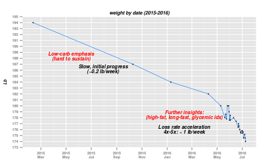
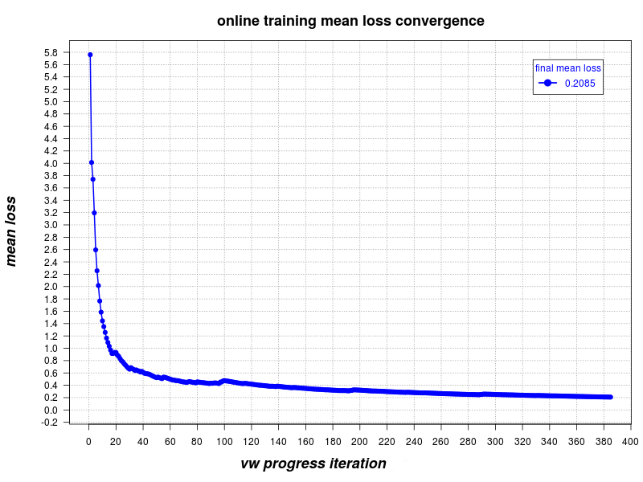

Discovering ketosis: _how to effectively lose weight_
=====================================================

### _Here is a chart of my weight vs. time in the past 16 months or so:_

 

The chart was generated from a data-set [`weight.2015.csv`](weight.2015.csv) by the script [`date-weight.r`](date-weight.r) in this git repository.  It requires [`R`](http://r-project.org) and [`ggplot2`](http://ggplot2.org/).

In the following I'll describe the thought process, some other people ideas, and the code I used to separate signal from noise. This separation was critical to help lead me in the right direction.

This github repository includes my code, [a Q&A section](QandA.md), and links
for further reading.

#### Disclaimers:

The below is what worked for me. Your situation may be different. Listen to your own body. The code here is designed to be used on your own data, not on mine.

Also: this was *not* a scientific experiment, or a "study"; rather, it was a personal journey of experimentation and discovery.

With these behind us, I'd like to channel [Galileo in the face of the inquisition](https://en.wikipedia.org/wiki/Galileo_affair): evolution has been hard at work for 2 billion years shaping the chemistry of all eukaryotes, multi-cellular life and eventually mammals. The Krebs cycle, glucose metabolism, insulin spikes, glycogen in the liver, carnitine, lipase, are as real for you as they are for me. We may be very different in our genes and traits, some are more insulin resistant, for example, but we cannot be too different in our most fundamental metabolic chemistry. The chemistry which drives fat synthesis and break-up.

## Salient facts & initial observations

- I used to be a pretty thin person. My 1st DMV card below, says 143 lb.
- Unfortunately, since moving to the US, I've been gaining more and more weight. I peaked in 2015, over 50 lbs higher.
- The US is a country where obesity is an epidemic.
- Poorer demographics in the US have higher levels of obesity.

Does a US typical lifestyle has anything to do with this epidemic? After reading on the subject, I could point at a few of the main suspects:

 - Fast food is highly available, and is very cheap compared to most alternatives
 - Most food we buy and eat is heavily processed -- watch [Food, Inc. (documentary)](http://www.takepart.com/foodinc/film)
 - "No Fat" and "Low Fat" labels are everywhere on supermarket shelves
 - Many foods are enriched and sweetened with high-fructose corn-syrup -- watch [Sugar Coated (documentary)](http://sugarcoateddoc.com/)

As in many other instances, I realized I need to think for myself. Ignore all "expert" advice. Question widely accepted ideas like the FDA "food pyramid". Start listening to my own body, my own logic & data I can collect myself and trust.

Once I did, the results followed.

## What didn't work

In the past, I tried several times to change my diet. After reading one of Atkins' books, I realized, checked, and accepted the fact that excess carbs are a major factor in gaining weight. But that realization alone has not led to success.

My will power, apparently, was insufficient. I had too much love of pizza and bread.  I would reduce my carb consumption, lose a few pounds (typically ~5 pounds), and then break-down, go back to consuming excess carbs, and gain all these pounds back, and then some. My longest diet stretch lasted just a few months.

It was obvious that something was missing in my method. I just had to find it.  I could increase my physical activity, say start training for a mini-marathon, but that's not something I felt comfortable with.

I realized early on that I need to adopt a lifestyle that not just reduces carbs, or add exercise, but is also sustainable and even enjoyable so it can turn into a painless routine. Something that:

> - I could do for years
> - Never feel the urge to break habits
> - Is not hard, or unpleasant for me to do

## Early insights & eureka moments

Early in the process I figured I could use [machine learning](https://en.wikipedia.org/wiki/Machine_learning) to identify the factors that made me gain or lose weight. I used a simple method: every morning I would weigh myself, and record both the new weights and whatever I did in the past ~24 hours, not just the food I ate, but also whether I exercised, slept too little or too much, etc.

The file I kept was fairly simple. A CSV with 3 columns:

> *Date*, *MorningWeight*, *Yesterday's lifestyle/food/actions*

The last column is a arbitrary-length list of *`word[:weight]`* items.

The (optional) numerical-weight following `:`, expresses higher/lower quantities. The default weight, when missing is 1:
 
    #
    # -- Comment lines (ignored)
    #
    Date,MorningWeight,YesterdayFactors
    2012-06-10,185.0,
    2012-06-11,182.6,salad sleep bacon cheese tea halfnhalf icecream
    2012-06-12,181.0,sleep egg
    2012-06-13,183.6,mottsfruitsnack:2 pizza:0.5 bread:0.5 date:3 dietsnapple splenda milk nosleep
    2012-06-14,183.6,coffeecandy:2 egg mayo cheese:2 rice meat bread:0.5 peanut:0.4
    2012-06-15,183.4,meat sugarlesscandy salad cherry:4 bread:0 dietsnapple:0.5 egg mayo oliveoil
    2012-06-16,183.6,caprise bread grape:0.2 pasadena sugaryogurt dietsnapple:0.5 peanut:0.4 hotdog
    2012-06-17,182.6,grape meat pistachio:5 peanut:5 cheese sorbet:5 orangejuice:2
    # and so on ...

Then I wrote [a script](lifestyle-csv2vw) to convert this file to [vowpal-wabbit](https://github.com/JohnLangford/vowpal_wabbit/wiki) training-set regression format. In the converted train-set the label (target feature) is the change in weight (delta) in the past 24 hours, and the input features are what I've done or ate in the ~24 hours leading to this delta -- a straight copy of the 3rd column.

I was not dieting at that time. Just collecting data.

The machine learning process error-convergence after partly sorting the lines descending, by `abs(delta)` to smooth it out and try to amplify very weak signals from the data, and 4-passes over the data, looks like this:

You can reproduce my work by compiling your own data-file, installing all prerequisites, and running `make` in this directory.  I wrote a [HOWTO file with more detailed instructions](HOWTO.md). Please open an issue, if anything doesn't work for you.

When you type `make` in this directory -- some magic happens.

Here's how a typical result looks like.

    $ make

    ... (output trimmed for brevity) ...

    FeatureName       HashVal   ...   Weight RelScore
    nosleep            143407   ...  +0.6654 90.29%
    melon              234655   ...  +0.4636 62.91%
    sugarlemonade      203375   ...  +0.3975 53.94%
    trailmix           174671   ...  +0.3362 45.63%
    bread              135055   ...  +0.3345 45.40%
    caramelizedwalnut  148079   ...  +0.3316 44.99%
    bun                  1791   ...  +0.3094 41.98%

    ... (trimmed for brevity. Caveat: data is too noisy anyway) ...

    stayhome           148879   ...  -0.2690 -36.50%
    bacon               64431   ...  -0.2998 -40.69%
    egg                197743   ...  -0.3221 -43.70%
    parmesan             3119   ...  -0.3385 -45.94%
    oliveoil           156831   ...  -0.3754 -50.95%
    halfnhalf          171855   ...  -0.4673 -63.41%
    sleep              127071   ...  -0.7369 -100.00%

The positive (top) relative-score values are life-style choices that make you ***gain weight***, while the negative ones (bottom) make you ***lose weight***.

##### And here's a variable-importance chart made from a similar data-set:

Disclaimer: please don't read too much into the particulars of this data. Working with this particular data set, was pretty challenging, since:

- The number of original data-points (a bit over 100 days) may be too small to establish enough significance.
- Typical daily changes in body weight are very small, often ~0.1 lb.
- My scales are not accurate: you may note that my data has 0.2 pound resolution. This is not ideal. Getting scales with 0.1 pound resolution is highly recommended.
- You may also note that the loss-convergence chart hits a hard floor at ~0.2 even when you do multiple-passes over the data (overfit the training-set) for a similar reason.
- Items that make you lose and gain weight, often appear together on the same line so they cancel each other. This throws the automatic learning process off-course.
- There were some misspellings in the original data (I hope I fixed all of these by now)

So I focused mostly on the extremes (start and end) of the list as presented above, and just used the hints as general guidance for further study, experimentation, and action.

Despite the noisy & insufficient data, and the inaccuracies in weighting, the machine-learning experiments made 4 facts pretty clear, pretty early:

- Sleeping longer consistently appeared as *the* #1 factor in losing weight.
- Lack of sleep did the opposite: too little sleep lead to weight gains.
- Carbs made me gain weight. The worst were high-starch and sugary foods.
- Fatty and oily foods tended to do the opposite: they were positively correlated with weight-loss.

The 'stayhome' lifestlye, which fell mostly on weekends, may have been a red-herring: I slept longer when I didn't have to commute to work, OTOH: my diet on stay-home days may have been different.

It took me a while to figure out the sleep part. *When we sleep we don't eat*. It is that simple.

Moreover: we tend to binge and snack while not particularly hungry, but we never do it during sleep.

Our sleeping time is our longest daily fasting time.

Please note that my explanations of the effects may not in fact be accurate or deeply scientific.
The goal of all this was incremental discovery: experiment, check effect, rinse, repeat.

## Further progress

You may note that in the top (date vs. weight) chart there's a notable acceleration in the rate of weight-loss.  The cause was deeper insights and better ability to sustain the diet the more I understood the problem.

***Extending the fasting time*** was one major accelerator of weight-loss rate. I did that by:

> - Skipping breakfast and
> - Stop eating earlier in the evening before going to bed.

This gave me 14-16 hours of fasting each day. Rather than the more typical 10-12 hours/day of fasting.

The 2nd accelerator was ***consuming fatty stuff*** (instead of carbs) in order to feel full.

The 3rd accelerator was understanding the concepts of [Glycemic index](https://en.wikipedia.org/wiki/Glycemic_index) and [***Glycemic Load***](https://en.wikipedia.org/wiki/Glycemic_load), and shifting whatever I chose to eat towards ***lower Glycemic loads***.

I now believe and hope that I can go all the way back to my original weight when I first landed on US soil.

If I can keep the present rate, it should take 1-2 years to completely reverse the damage of the past ~20 years. 

It is important to stress that I also *feel much better the more weight I lose*. As a welcome side-effect, the few borderline/high levels in my blood tests, have moved significantly towards normal averages, during the period I lost weight.

### What was my data and clear improvement in health saying?

Looking at my data, and reading more, convinced me that I should beware of doctors [who push statins](https://www.google.com/search?q=the+truth+about+statins) instead of suggesting a better diet. I started doubting anyone who told me I need to *reduce* fat. I run away if anyone now tells me "high cholesterol" in the diet is dangerous.

Cholesterol, by the way, is an essential building block for many essential body by-products. The liver produces as much cholesterol as we need.

Our body is an amazing machine. Billions of years of evolution have made it extremely *adaptive*.

It is not our ***high fat consumption***, it is the ***storage of fat process*** that makes us acummulate fat in the tissues and become unhealthy.

An enzyme called *Lipase* breaks-up fat. Raise the levels of Lipase and our body fat gets consumed faster. To get there, we need to give the body fat as an *alternative* to carbohydrates.  When the body has depleted both the blood sugar, and the glycogen (hydrated sugar) buffer in the liver, it has no other choice but to *adapt and compensate*.  Our source of energy -- [ATP synthesis](https://en.wikipedia.org/wiki/Adenosine_triphosphate) -- switches from carbs to fats by producing more fat-breaking agents.  The body is a "Flex Fuel" kind of machine, that has simply replaced one fuel (carbs) with another (fat).

When Lipase, and all other agents in the fat-to-ATP chemical path, aka [Beta oxidation](https://en.wikipedia.org/wiki/Beta_oxidation) mobilize, and their levels are elevated, we burn more fat and lose weight over time.

In a low-carb/high-fat (LCHF) regime, our night sleep (fasting time) becomes our friend.  The fat-breaking agents keep working while we sleep, breaking-up the stored fat.  This leads to weight-loss, and a healthier state.

And when we push even further, and cut carbs to *really* low levels, we may reach a new steady state, called ketosis, in which practically all our energy comes from fat, and that's when we really win big in the weight-loss battle.

The above is a very simplified, and hopefuly easy to digest, version of what some diet books try to explain in hundreds of pages.

## My bottom-line recipe:

- The hardest part (especially at the beginning) is reducing carbs. The worst are starch rich foods (pizza, pasta, bread etc.), then processed foods with high sugar content (sweet sodas, no-pulp juices, etc). This doesn't mean ***no*** carbs. You may afford yourself carbs from time to time (say a pizza once a week). As it turns out, an occasional lapse isn't enough to completely reverse any steady-state.  However, you need to make sure you consume ***much less carbs*** and ***less frequently*** than before. In particular, you must avoid binging on snacks like chips, pizza, doughnuts, pasta, and bread, or drinking sugar-rich drinks.

- [Look-up Glycemic index](https://en.wikipedia.org/wiki/Glycemic_index) and [Glycemic Load](https://en.wikipedia.org/wiki/Glycemic_load) on wikipedia. ***Avoid foods with high glycemic load***. This prevents the blood sugar spikes which lead to insulin spikes and tell the body chemical cycles to revert back from ketosis, or near ketosis, to fat-accumulation.  Have a sweet tooth? Eat an orange instead of drinking orange juice. The two have vastly different glycemic loads and this makes a huge difference. If you must add sweetness to your cup of tea or coffee, use a [Splenda (sucralose+dextrose) tablet](https://en.wikipedia.org/wiki/Splenda), or [a Stevia drop/tablet](https://en.wikipedia.org/wiki/Stevia) which typically weight just ~0.1 gram, rather than a tea-spoon of sugar (~4.2g, about 40x more). Result: similar sweetness effect, but much lower Glycemic load and resulting levels of blood-glucose.

- High fat: I switched from milk to half-and-half and am considering heavy (and unsweetened) whipped cream. It has less carbs (lactose) and more fat; plus, it tastes better.  Eat avocados, olive oil, mayo, coconut oil, nuts.  I never worry about *natural* fat, I eat as much fat as I want. This is what makes it much easier to avoid carbs. When I stuff myself with fat I feel much less hungry and miss the carbs less. The body is very good at figuring this out: "I have too much fat in the blood, so let's increase the amount of enzymes which break-up fat" and this makes me lose weight in the long run.  Most importantly, I always ***avoid any products labeled "low-fat" or "fat-free"***. The food industry usually replaces fat with sugar, so it tastes better - otherwise it tastes awful. You'll often hear about "bad" vs "good" fat. My take: as long as it is natural, it is ok. The worst trans-fat is fat that's artificially hydrogenated, to increase shelf-life, by the food industry. The less saturated fat is, the better. Mono-saturated (plant) liquid oil is the best, then come the poly-unsaturated fats, and finally near saturated (but not fully saturated) fats that come from animals. My buttery-spread spectrum is:  *Margarine: no; Butter: ok; Earth Balance: no problem*. At any rate, even the most saturated fat, gets broken and depleted by the natural processes in the body.

- A bit of exercise.  Of course, more is better, but for many this may prove difficult. I don't excercise too much. I just bike to work and back about 20 min each way, meaning 40 min/day, 5 out of 7 days/week. You can try walking the dog (but walk faster), or Zumba dance to music. The trick is to find something that you don't find hard to do. Or find company to do it together. Then, do a little bit of it every day.

- ***Longer fasting periods:*** This is the #1 contributor to weight-loss. sleep longer, stop eating as early as possible before going to sleep and start eating as late as possible after sleeping. *Skip breakfast*, after some time you won't feel hungry in the morning anymore.  After long periods of fasting, the body chemistry adjusts. It needs ATP, but there's a too low level of glucose in the blood. The glycogen in the liver is fully consumed (this takes about 1-2 days of low or no carbs) so there's no other option, but to start looking for other sources, like stored fat. This elevates the enzymes that help with breaking up fat and the Krebs cycle reverses direction in the critical paths. Instead of transforming excess-carbs into stored fat, we break-up stored fat for energy.

- Eat eggs.  They are a wonderful combo of fat and protein with no carbs at all.  I read an interview with a [Japanese woman who reached 114 years](Longevity.md) and one of her secrets was to eat eggs daily.  My favorite food is a scrambled egg with grilled onions (onions are a bit high on carbs, but too tasty to give up) and olives.

- Eat slower, and chew longer... don't swallow just yet! Humans, just like dogs, tend to swallow too soon. Stop eating when you feel full. There's about 20 min delay before your brain registers that you are full so don't over-eat.

***

## Further reading:

- [The Krebs (aka Citric acid) cycle](https://en.wikipedia.org/wiki/Citric_acid_cycle)
- [Spikes of Insulin and their effects](https://en.wikipedia.org/wiki/Sugar_crash) -- what the body does when it has excess of sugar vs excess of fat.
- [Glycemic Index](https://en.wikipedia.org/wiki/Glycemic_index)
- [Glycemic Load](https://en.wikipedia.org/wiki/Glycemic_load) -- a better metric for weight-loss than Glycemic Index.
- [Glycogen and its storage in the liver](https://en.wikipedia.org/wiki/Glycogen)
- [Ketone bodies](https://en.wikipedia.org/wiki/Ketone_bodies)
- [Ketosis -- not to be confused with keto-acidosis](https://en.wikipedia.org/wiki/Ketosis)
- [Ketogenic diet](https://en.wikipedia.org/wiki/Ketogenic_diet)

<!--
- [The Eating Academy / Peter Attia, M.D.](http://eatingacademy.com/)
-->

- [Why We Get Fat: And What to Do About It / Gary Taubes](http://www.amazon.com/gp/product/0307272702)
- [Summary of Good Calories, Bad Calories / Gary Taub by Lower Thought](https://lowerthought.wordpress.com/complete-notes-to-good-calories-bad-calories/)
- [The Obesity Code: Unlocking the Secrets of Weight Loss / Jason Fung](https://www.amazon.com/Obesity-Code-Unlocking-Secrets-Weight-ebook/dp/B01C6D0LCK/)
- [The best summary about statins I've seen](http://www.newswithviews.com/Howenstine/james23.htm)
- [High cholesterol doesn't cause heart disease](http://www.telegraph.co.uk/science/2016/06/12/high-cholesterol-does-not-cause-heart-disease-new-research-finds/)
- [Dr. Mark Hyman take on a good diet (a bit different than mine)](http://drhyman.com/blog/2014/08/18/one-test-doctor-isnt-save-life/)

#### Documentaries:

- [Food, Inc. (2008)](https://www.netflix.com/title/70108783)
-  [Sugar Coated (2015)](https://www.netflix.com/title/80100595)

#### More videos

- [Reversing Type 2 diabetes starts with ignoring the guidelines | Sarah Hallberg | TEDxPurdueU](https://www.youtube.com/watch?v=da1vvigy5tQ)

A nice 7:41 minute video of James McCarter in Quantified Self (an eye opener for me):

- [James McCarter: The Effects of a Year in Ketosis](https://vimeo.com/147795263) 

#### Questions, Answers, Comments

[Some questions and comments I got and tried to answer](QandA.md)

#### More friendly interface

[Shyal Beardsley](http://shyal.com) has built a starter front-end for this: ***[weightbrains.com](http://weightbrains.com)***
(Note and fair warning: this is a prototype, experimental, work in progress)

## Acknowledgements

Big thanks to the following people for contributing to this project in myriad ways,
comments, references, corrections, etc.

_Anat Faigon, Ingrid Kane, Hans Lee, Steve Malmskog, Eyal Friedman, Shiri Shoham, Gabi Harel, Shingi, Noa_

_Update: 2016-08-12: this project made [Hacker News](https://news.ycombinator.com/item?id=12279415) and reached the top place for a while. Thanks for some great comments by benkuhn, aab0, zzleeper, and others which helped me make it better._

Special thanks to John Langford and the many other contributors to [vowpal wabbit](https://en.wikipedia.org/wiki/Vowpal_Wabbit).

#### License:

This code and additional material are released under a permissive and simple [2-clause BSD licence](Licence.md).  The one sentence summary of this is "as long as you don't sue me and not claim it as your own, you should be ok."

